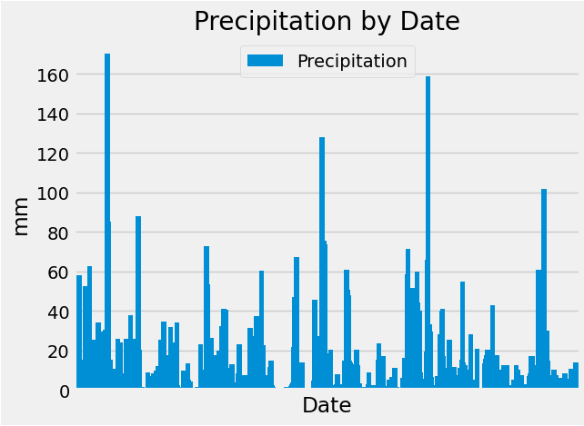

Files included in repository

climate_starter.ipynb
This file reads Hawaii weather data from hawaii.sqlite and generates analysis for precipitation data over one year.

It also generates temperature observations (TOBS) histogram for busiest observation station over 1 yr data.

app.py
This is a flask website. It has following pages.
/
/api/v1.0/precipitation
/api/v1.0/stations
/api/v1.0/tobs
/api/v1.0/<start>
/api/v1.0/<start>/<end>
